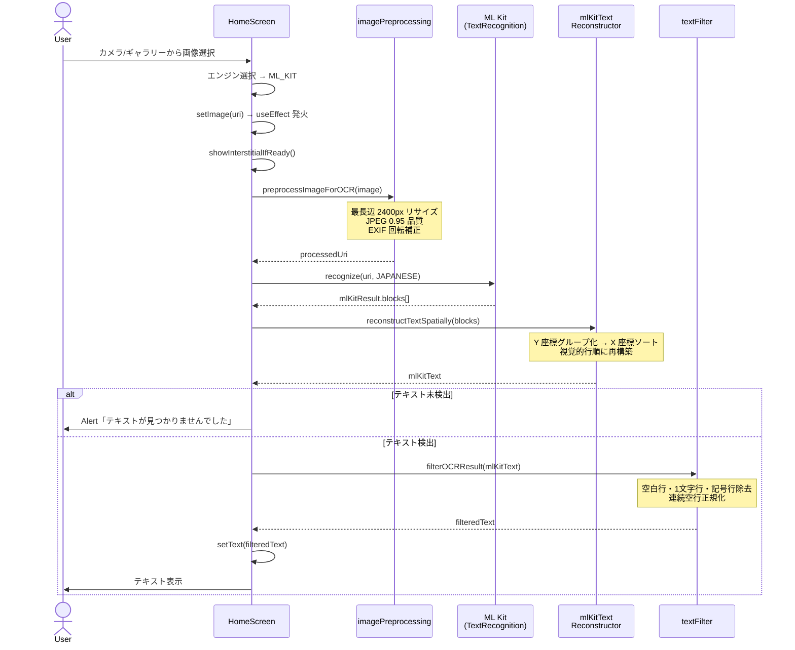
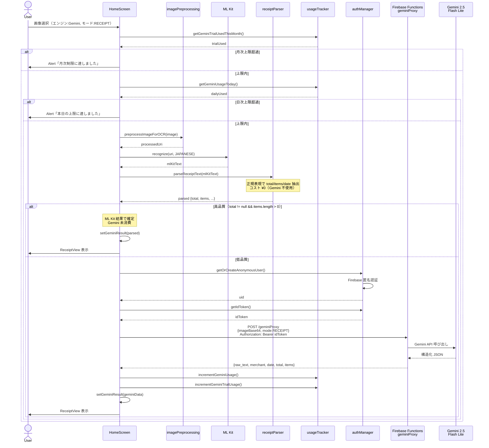
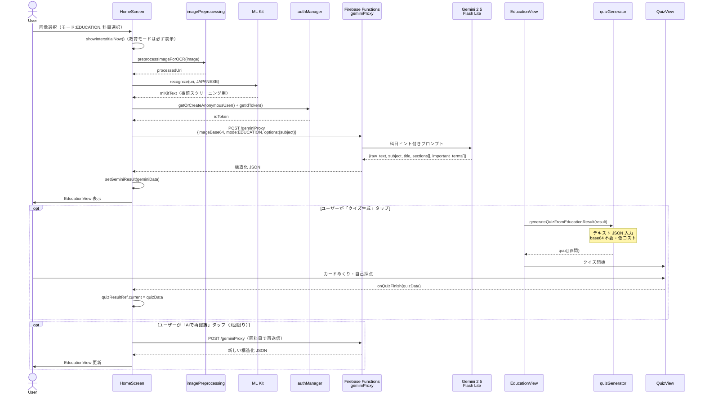
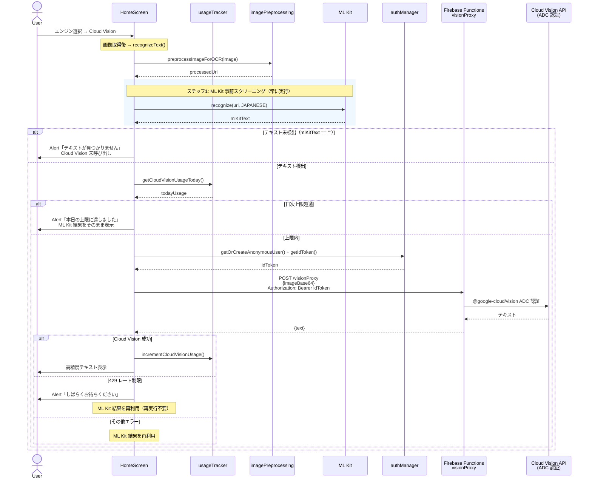
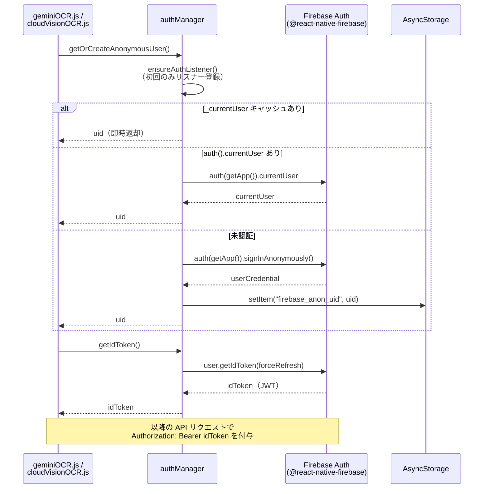

# OCR アプリ シーケンス図

このファイルは各 OCR フローの処理手順を Mermaid 記法で記述したものです。
VS Code の Markdown Preview Enhanced 拡張機能や GitHub でレンダリングできます。

---

## 1. GENERALモード OCR フロー（ML Kit のみ）

---

## 2. RECEIPTモード OCR フロー（ハイブリッド方式）

---

## 3. EDUCATIONモード OCR フロー

---

## 4. Cloud Vision 手書き認識フロー（GENERALモード）

---

## 5. Firebase 匿名認証フロー（authManager.js）

